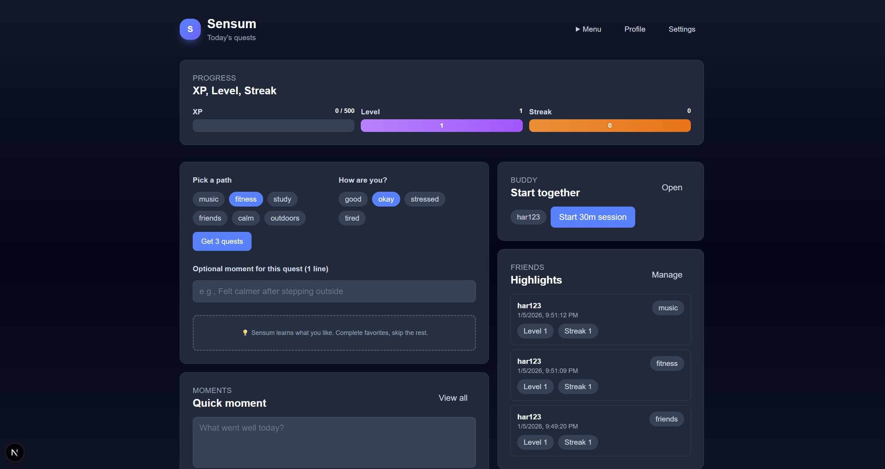
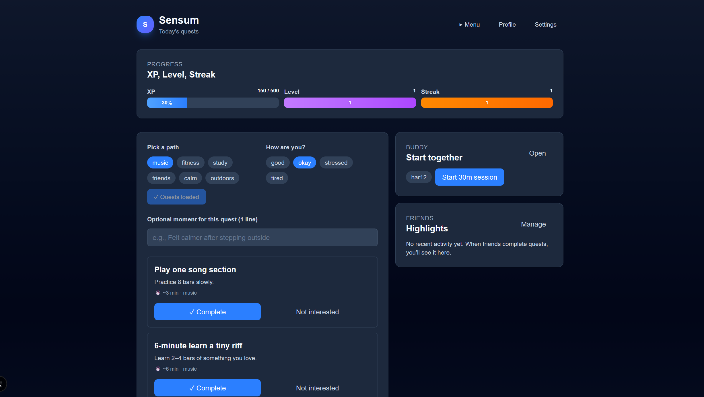
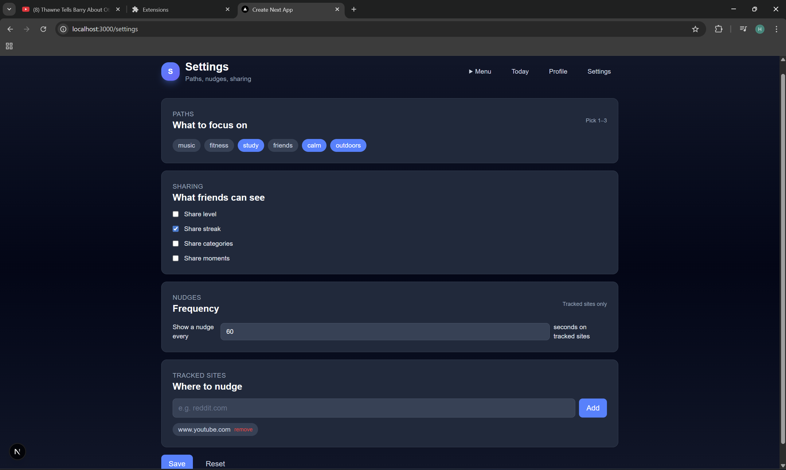
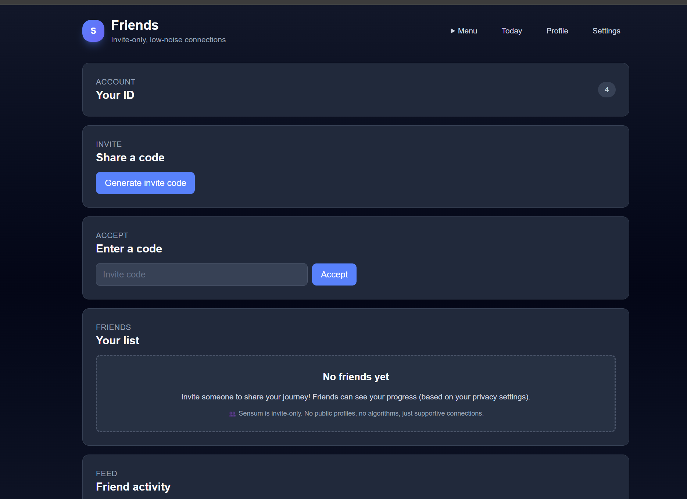
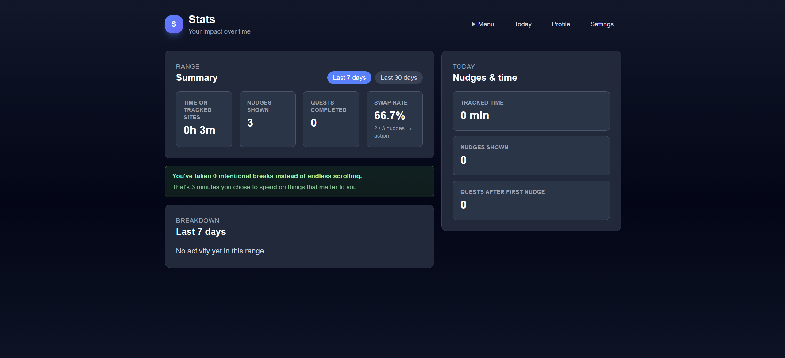
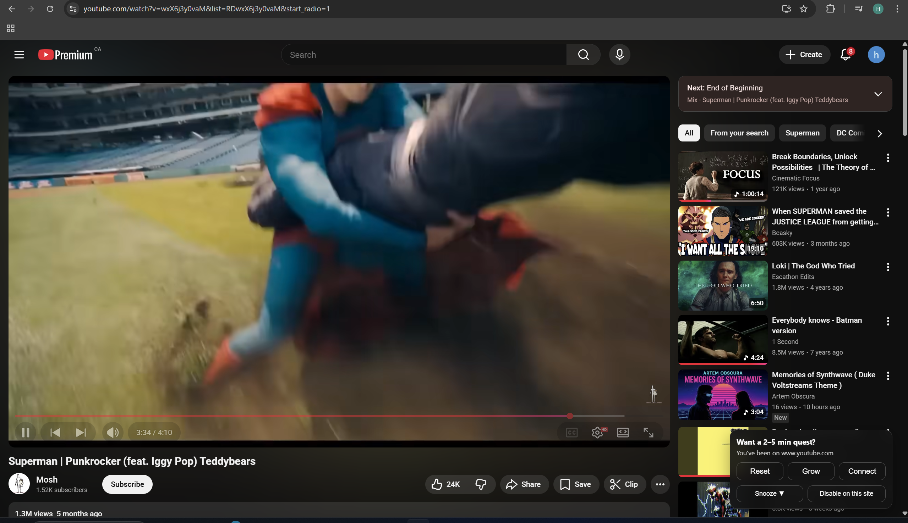
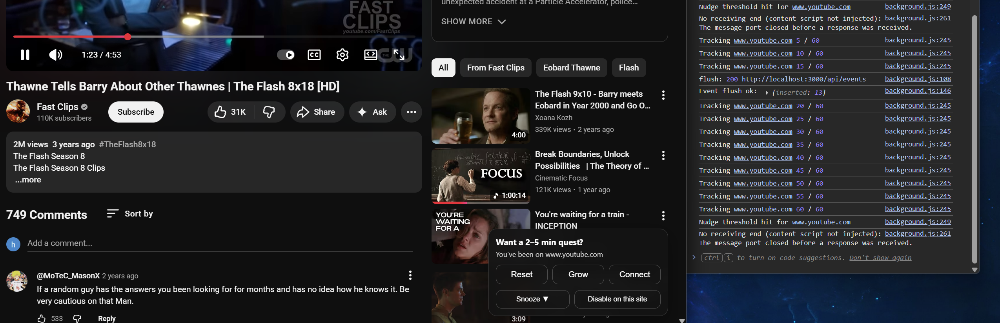

# Sensum

Sensum is a focused wellbeing + productivity app that helps you become more intentional about time online. It pairs gentle browser nudges with quick “quests” (2–10 minutes) you can complete offline (Calm, Fitness, Study, Music, Friends, Outdoors).

This repository is a monorepo containing:

- **Web app** (Next.js + TypeScript + Tailwind): quests, progress, moments journal, settings, friends feed, buddy sessions.
- **Backend API** (Spring Boot + Postgres): authentication, recommendations, persistence, social features, analytics.
- **Browser extension (Manifest V3)**: time tracking on selected sites, overlay nudges, telemetry batching.

## Key features

- **Secure auth:** email/password + BCrypt hashing; JWT stored in an HttpOnly cookie (`sensum_token`).
- **Quest loop:** recommend 3 quests, complete/skip/snooze, award XP, compute level + daily streak.
- **Personalization (v1):** learns from historical outcomes (complete/skip) and adds light randomness for exploration.
- **Moments journal:** save short reflections either alongside quest completions or as standalone entries.
- **Invite-only social:** create invite codes, accept invites, control sharing via per-user privacy settings.
- **Buddy sessions:** start/join sessions, check in, end sessions.
- **Extension nudges:** per-domain snooze/disable, cooldowns, event batching + periodic flush to the API.

## Architecture

```mermaid
flowchart LR
  Ext[Browser Extension] -->|POST /api/events (cookies)| WebOrigin[Next.js @ localhost:3000]
  WebOrigin -->|rewrite /api/* -> backend| API[Spring Boot @ localhost:8080]
  API --> DB[(Postgres)]
```

Notes:

- Backend is stateless; authentication is via an HttpOnly JWT cookie.
- The web app and extension must send cookies (web uses `credentials: "include"`).

## Tech stack

- **Frontend:** Next.js (App Router), React, TypeScript, Tailwind CSS
- **Backend:** Java 17, Spring Boot (WebMVC, Security, Validation), Spring Data JPA
- **Database:** PostgreSQL + Flyway migrations
- **Extension:** Chrome/Edge MV3 (service worker background + content script overlay)

## Repo structure

```text
sensum/
  backend/     Spring Boot API + Flyway migrations
  web/         Next.js web app
  extension/   Chromium extension (MV3)
  docker-compose.yml
```

Extension details (install/usage/internals): see [extension.md](extension.md).

## Screenshots / demo

Screenshots (from `docs/screenshots/`):

- Today (highlights)
  - 
- Today (quests)
  - 
- Settings
  - 
- Friends
  - 
- Stats
  - 
- Extension
  - 
  - 

Metrics note:

- The Stats page currently highlights total quests completed.
- A future improvement is to show “quests completed after opening Sensum from the extension (popup or nudge)” (by explicitly tracking app opens from the extension) so the number better matches “intentional breaks.”

## Run locally

### 1) Start Postgres

From the repo root:

```bash
docker compose up -d
```

Postgres runs on `localhost:5432` (credentials in `docker-compose.yml`).

### 2) Start the backend

```powershell
cd backend
.\mvnw spring-boot:run
```

Backend: `http://localhost:8080`

### 3) Start the web app

```powershell
cd web
npm install
npm run dev
```

Web: `http://localhost:3000`

### 4) Load the extension (optional)

1. Open `chrome://extensions`
2. Enable **Developer mode**
3. Click **Load unpacked**
4. Select the `extension/` folder

The extension posts events to `http://localhost:3000/api/events` (which Next rewrites to the backend).

## Quest recommendation algorithm (v1)

Endpoint:

- `GET /quests/recommendations?path=<category>`

Candidate pool:

- All quests where `quest.category == path`

If authenticated, Sensum computes a per-quest score from historical outcomes:

$$score = 2 \times completed - 1 \times skipped$$

- Outcomes are stored in `quest_outcomes` (`completed`, `skipped`, `snoozed`).
- `snoozed` is recorded but not currently used in scoring.
- A small random factor is added during sorting so similarly-scored quests rotate.

## API overview (high level)

- **Auth:** `POST /auth/signup`, `POST /auth/login`, `POST /auth/logout`, `GET /me`
- **Settings:** `GET /me/settings`, `PUT /me/settings`
- **Quests:** `GET /quests/recommendations`, `POST /quests/complete`, `POST /quests/skip`, `POST /quests/snooze`
- **Events:** `POST /events` (accepts single or batch)
- **Moments:** `GET /me/moments`, `POST /me/moments`
- **Quest history:** `GET /me/quests/completions`
- **Friends:** invite codes, accept, list, feed
- **Buddy:** start/join/checkin/end + list/session details
- **Stats:** `GET /stats/today`, `GET /stats/summary`

## Engineering principles demonstrated

- **Security-first defaults:** BCrypt hashing; HttpOnly cookie JWT; server-side user attribution.
- **Separation of concerns:** frontend uses `/api/*` proxy; backend owns validation and persistence.
- **Explainable personalization:** simple scoring + feedback loop from user actions.
- **Resilient telemetry:** extension batches events and flushes periodically.

## Quick smoke test (optional)

Validate auth + `/me` + `/events` end-to-end:

```powershell
$base = "http://localhost:8080"

$email = "demo-$([Guid]::NewGuid().ToString('N').Substring(0,8))@example.com"
$pass  = "password123"

$signupBody = @{ email = $email; password = $pass } | ConvertTo-Json
Invoke-WebRequest -UseBasicParsing -Uri "$base/auth/signup" -Method Post -ContentType "application/json" -Body $signupBody -SessionVariable sess

Invoke-RestMethod -Uri "$base/me" -Method Get -WebSession $sess

$evt = @{ domain = "example.com"; durationSec = 30; eventType = "time_spent"; ts = (Get-Date).ToString("o") } | ConvertTo-Json
Invoke-RestMethod -Uri "$base/events" -Method Post -ContentType "application/json" -WebSession $sess -Body $evt
```

## Dev notes

- The web app calls the backend via `/api/*`.
- In local dev, Next.js rewrites `/api/:path*` to `http://localhost:8080/:path*` (see [web/next.config.js](web/next.config.js)).
- `web/next.config.ts` exists, but the rewrite currently lives in the JS config.
